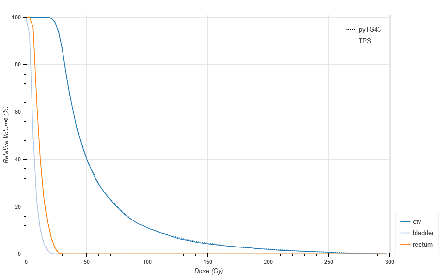

# pyTG43

pyTG43 uses user-defined source specification data as well as TPS-defined dwell positions and times to calculate dose at a specific point using the 2D formalism outlined in [AAPM TG-43](http://dx.doi.org/10.1118/1.1646040).

pyTG43 has only been tested on files from Eclipse treatment planning systems. No warranty or support is provided.

## Installation

```
git clone https://github.com/livingag/pyTG43.git
cd pyTG43
python setup.py install
```

## Calculation details

The co-ordinate system used by the software is [IEC 61217](https://i.imgur.com/k926EqO.png), which is used by most planning systems. Keep in mind this is different from the [DICOM](http://dicom.nema.org/DICOM/2013/output/chtml/part17/figures/PS3.17_FFF.1.2-3.svg) co-ordinate system.

Dwell point co-ordinates and times are extracted from the DICOM plan file, along with the applicator structures from the DICOM structure set file.

For each dwell point, the orientation of the line source is determined by the vector of the two nearest points of the applicator structure for that dwell point. The relevant angles and distances required by the TG-43 formalism are then easily determined through vector calculus.

### Rotated data sets

For DVH calculation of rotated co-ordinate systems (e.g. when planning on rotated/manipulated CT datasets), the co-ordinates of the structures are transformed into an intermediate co-ordinate system so that dose data can be easily collected from the calculation grid.

## Source specification data

All source specification data can be downloaded in spreadsheet form from the [ESTRO website](https://www.estro.org/About/ESTRO-Organisation-Structure/Committees/GEC-ESTRO-Committee/GEC-ESTRO-BRAPHYQS). Just specify the directory in which you have placed the HDR and/or PDR spreadsheets, and pyTG43 will extract the relevant data.

## Example calculations

### Point dose comparison

Examples are provided for both HDR and PDR treatment plans, and can be run using `python examples.py`

Point-dose comparison does not open plots by default; pass `show_plot=True` to `pyTG43.tpsComp(...)` if you want the radial dose plot.

```bash
$ python examples.py
----------------------------------------
 Eclipse (HDR)
----------------------------------------
┌───────────┬───────┬───────┬──────┬──────────┬───────────┬──────────┐
│ Name      │ X     │ Y     │ Z    │ TPS (Gy) │ Calc (Gy) │ Diff (%) │
├───────────┼───────┼───────┼──────┼──────────┼───────────┼──────────┤
│ PtA_left  │ 1.91  │ -1.25 │ 2.28 │ 6.002    │ 5.998     │ 0.066    │
│ PtA_right │ -2.09 │ -1.25 │ 2.11 │ 6.136    │ 6.132     │ 0.065    │
└───────────┴───────┴───────┴──────┴──────────┴───────────┴──────────┘
----------------------------------------
 Eclipse (PDR)
----------------------------------------
┌────────────┬───────┬────────┬────────┬──────────┬───────────┬──────────┐
│ Name       │ X     │ Y      │ Z      │ TPS (Gy) │ Calc (Gy) │ Diff (%) │
├────────────┼───────┼────────┼────────┼──────────┼───────────┼──────────┤
│ PT A RIGHT │ -4.60 │ -17.25 │ -54.81 │ 22.537   │ 22.571    │ -0.151   │
│ PT A LEFT  │ -0.62 │ -17.30 │ -54.72 │ 23.173   │ 23.178    │ -0.024   │
└────────────┴───────┴────────┴────────┴──────────┴───────────┴──────────┘
```

### DVH calculation

An example PDR plan DVH comparison can be run using `python dvhcomp.py`

```bash
$ python dvhcomp.py
```

